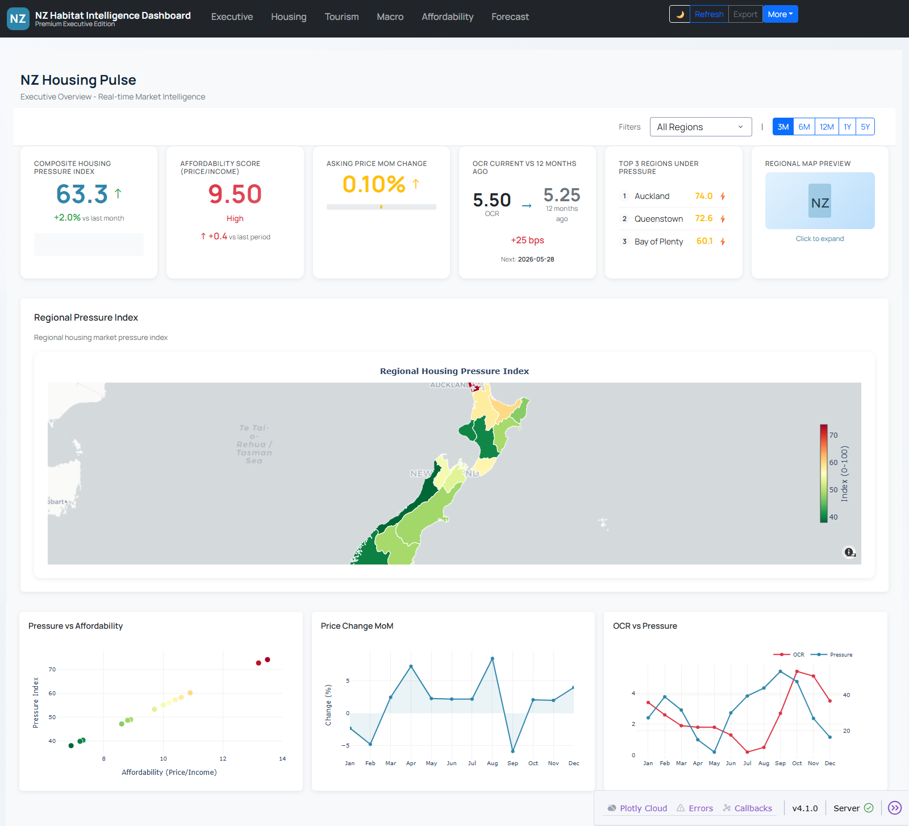
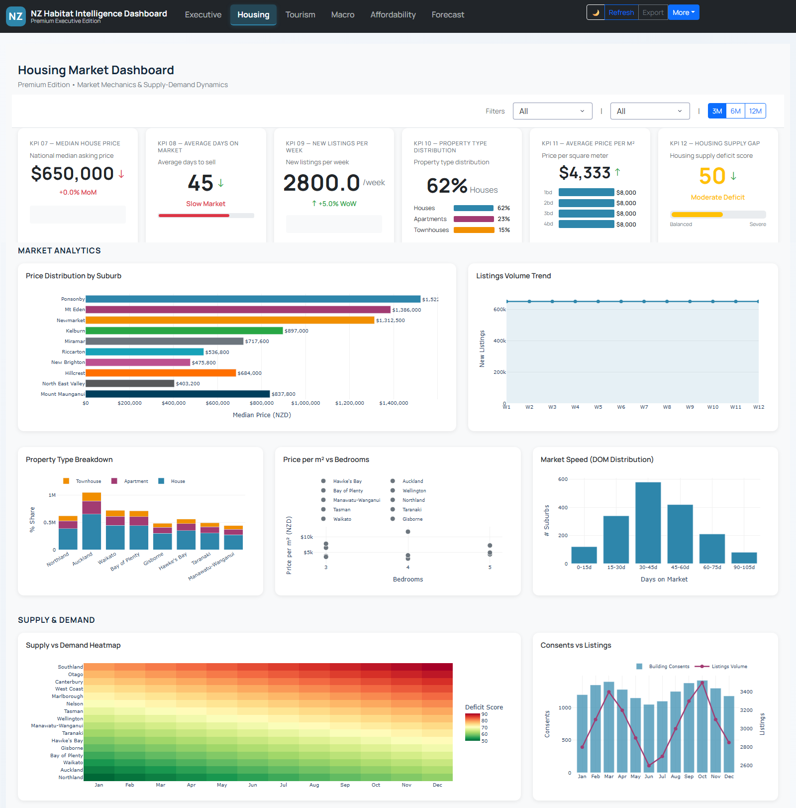
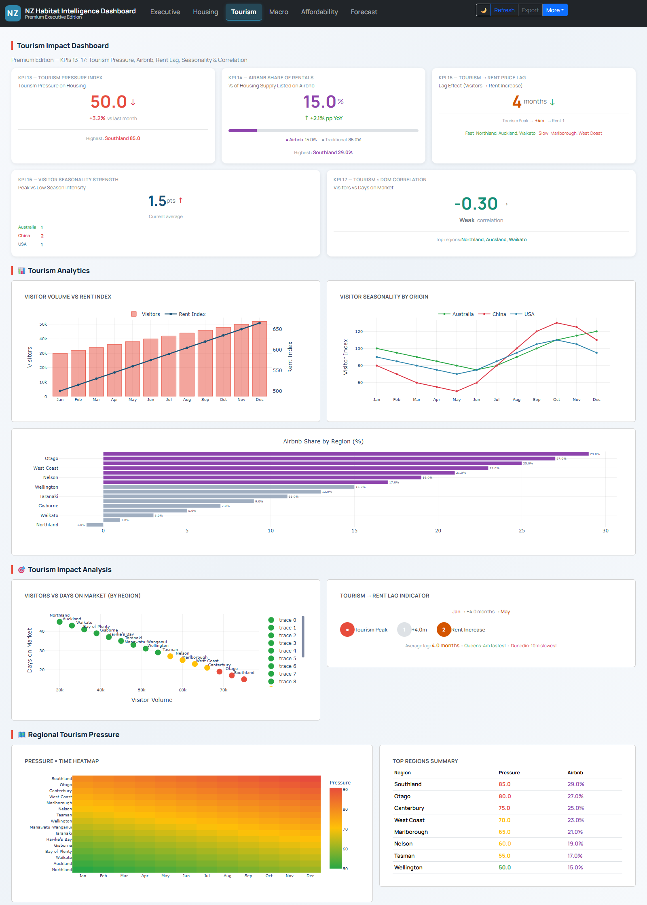
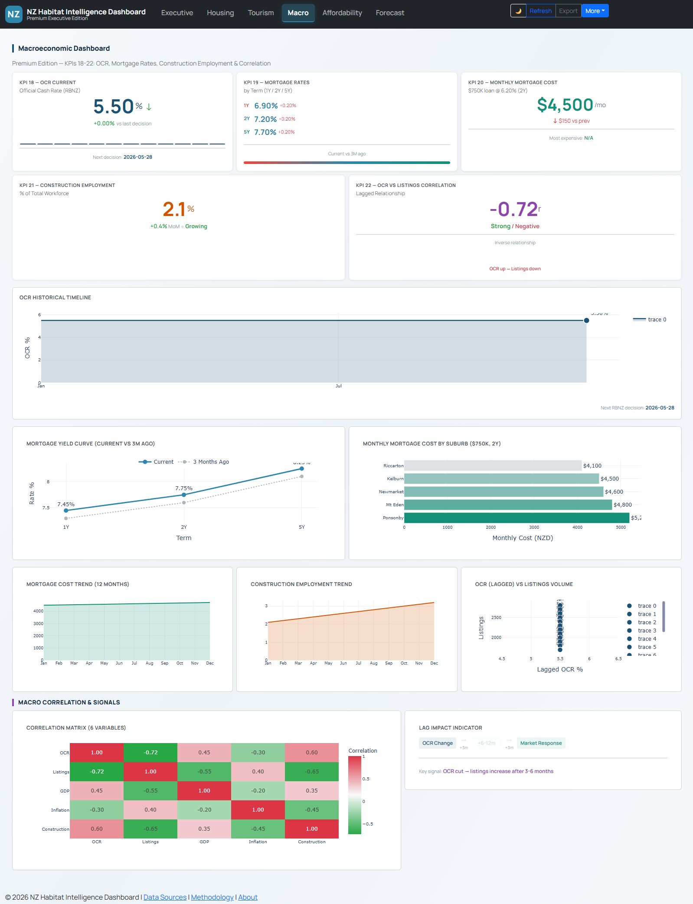
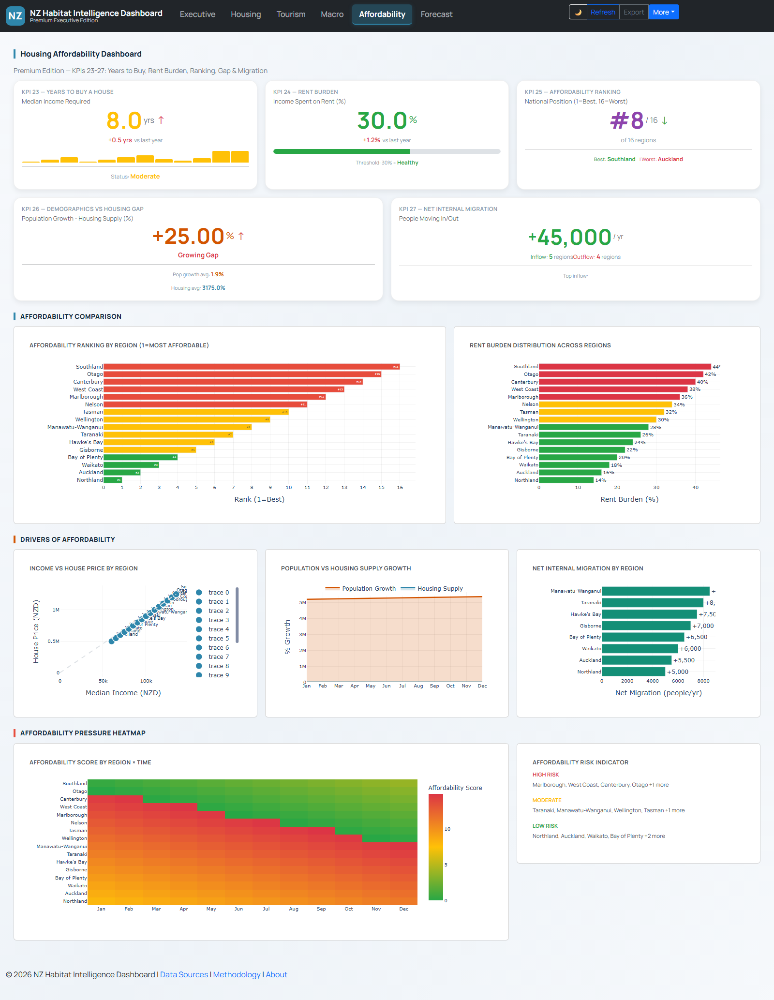
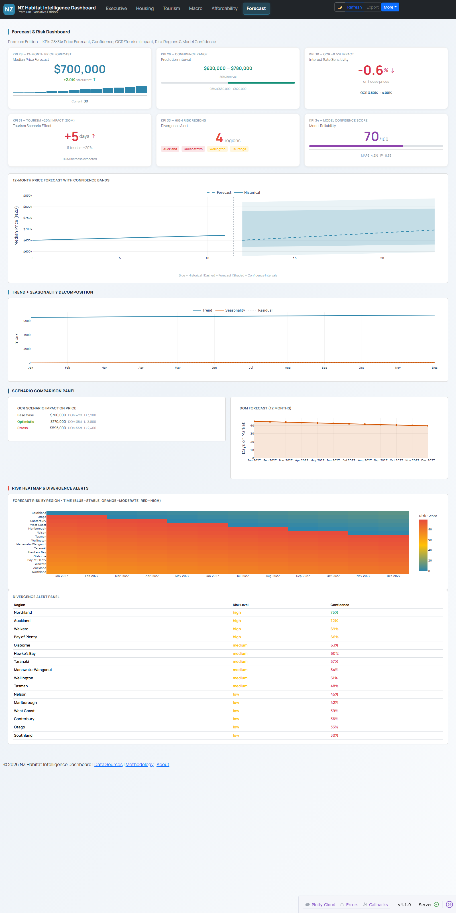

# NZ Habitat Intelligence

## Executive Summary

NZ Habitat Intelligence is a decision-support platform for the New Zealand housing market. It transforms fragmented government and macroeconomic data into a unified analytical view, enabling stakeholders to assess supply-demand imbalances, affordability trajectories, and macro-market correlations within a single session.

The platform supports three decision types:

- **Policy and regulatory planning** — Identify undersupply conditions and affordability erosion before they manifest in price pressure
- **Investment allocation** — Correlate tourism inflows, monetary policy shifts, and construction momentum with regional price movements
- **Market research and forecasting** — Generate 12-month price forecasts with confidence intervals and scenario modeling

The system is built on a four-stage data pipeline (Bronze, Silver, dbt Gold, Contracts) that ingests live government APIs, enforces data quality through expectation suites, and serves six domain-specific dashboards with 34 monitored KPIs.

---

## Dashboard Preview


*Executive Dashboard — Composite Habitat Intelligence Score with anomaly highlighting*


*Housing Dashboard — Supply-demand balance, construction momentum, and rental yield metrics*


*Tourism Dashboard — Tourism pressure index and short-term rental displacement tracking*


*Macro Dashboard — GDP growth, inflation, unemployment, and monetary policy correlation*


*Affordability Dashboard — Regional price-to-income and rent-to-income breakdowns*


*Forecast Dashboard — 12-month price forecasts with scenario analysis and model confidence*

---

## Problem Framing

New Zealand's housing market is analyzed through fragmented datasets spread across multiple government agencies. World Bank macroeconomic series, Stats NZ population and consent data, MBIE tourism flows, and RBNZ monetary policy indicators are all authoritative but exist in isolation. Integrating these sources for time-series analysis requires manual extraction, schema reconciliation, and repeated quality checks — a process that consumes analyst hours and introduces consistency risk.

Before this platform, deriving a single view of housing affordability required stitching together income data from Stats NZ, price proxies from consent volumes, and interest rate impacts from RBNZ releases. Cross-referencing tourism pressure with rental vacancy meant additional data pulls and ad-hoc spreadsheet modeling. The result was slow, non-reproducible analysis that could not be refreshed on demand.

This platform eliminates that friction by providing a single entry point where all sources are ingested, validated, and transformed into pre-computed KPIs. Analysts spend their time interpreting signals rather than preparing data.

---

## Key Metrics (KPI Layer)

The 34 KPIs are organized into six decision domains. Each KPI is defined by what it measures, what action it informs, and what risk or opportunity it surfaces.

### Executive Summary Domain

Eight composite and summary metrics designed for leadership consumption.

- **Habitat Intelligence Score** — A weighted composite of supply pressure, affordability, macro stability, and tourism impact. Surfaces overall market health in a single indicator. Informs portfolio-level risk assessment and strategic planning.
- **Economic Growth Per Capita** — Real GDP growth adjusted for population. Indicates whether housing demand is supported by productive economic expansion or fueled by non-fundamental factors.
- **Monetary Stability Index** — Volatility-adjusted OCR and mortgage rate trajectory. Flags periods of tightening or loosening that will directly impact debt serviceability and investor appetite.
- **Tourism Economic Impact** — Estimated housing market displacement from international visitor flows. Highlights regions where short-term rental pressure may be eroding long-term supply.
- **Housing Supply Deficit** — Building consents per capita against population growth. Signals impending price pressure when consents lag population growth by a structural margin.
- **Rent vs Inflation Gap** — Rental inflation spread over general CPI. A widening gap indicates housing cost burden is outpacing broader purchasing power.
- **Construction Activity Index** — Normalized consent and completion momentum. Provides early warning of supply pipeline slowdown.
- **Interest Rate Impact** — Estimated price sensitivity to 100bps OCR movement. Quantifies refinancing risk and investor yield compression.

### Housing Market Domain

Eighteen metrics covering supply, demand, pricing, and rental dynamics.

- **House Price Index Growth** — Year-over-year median price change by region. Informs entry and exit timing for development and investment decisions.
- **Rent Price Index Growth** — Year-over-year rent change by region. Signals yield compression or expansion for rental portfolios.
- **Housing Supply Ratio** — Available stock per household. Structural undersupply flags long-term price support.
- **Construction Activity Index** — Consents and completions momentum. Early indicator of future supply.
- **Vacancy Rate** — Estimated unoccupied dwelling percentage. High vacancy signals oversupply or demand destruction; low vacancy flags tight markets.
- **Price Growth YoY / Rent Growth YoY** — Comparative momentum metrics. Divergence between price and rent growth highlights bubble risk or yield opportunity.
- **Supply-Demand Balance** — Net position of population growth vs. consents. Negative balance triggers affordability pressure alerts.
- **Building Consents Trend** — 12-month rolling consent issuance. Leading indicator of construction pipeline health.
- **Construction Momentum** — Acceleration or deceleration in consent growth. Flags inflection points in supply response.
- **Housing Affordability Pressure** — Composite of price-to-income and rent-to-income. Breaches trigger policy intervention discussions.
- **Price-to-Rent Ratio** — Implied rental yield inverse. Elevated ratios signal overvaluation relative to income generation.
- **Rental Yield** — Annual rent as percentage of estimated property value. Directly informs buy-vs-hold investment decisions.
- **Housing Stock Growth** — Net addition to dwelling stock. Must exceed household formation to stabilize prices.
- **New Build Rate** — New dwellings as percentage of existing stock. Below replacement rate flags future shortage.
- **Market Tightness Index** — Composite of days on market, listing volumes, and clearance rates. Extreme values signal imminent price inflection.
- **Price Momentum / Rent Momentum** — Rolling 3-month and 12-month acceleration. Captures turning points before they appear in headline figures.

### Tourism Impact Domain

Five metrics quantifying the tourism sector's influence on housing availability.

- **Tourism Pressure Index** — Visitor arrivals normalized by regional housing stock. High values identify markets where tourism competes with residents for dwellings.
- **Short-Term Rental Penetration** — Estimated share of stock on short-term platforms. Rapid growth flags regulatory or zoning review needs.
- **Tourism-Housing Correlation** — Statistical relationship between visitor growth and rent inflation. Quantifies displacement effect strength.
- **Visitor Seasonality Strength** — Amplitude of quarterly visitor variance. High seasonality creates boom-bust rental income patterns.
- **International Visitor Impact** — Marginal price effect of 10% visitor increase. Supports scenario modeling for tourism policy changes.

### Macroeconomic Context Domain

Ten macro indicators that provide the demand and financing backdrop for housing outcomes.

- **GDP Growth Rate** — Real quarterly GDP change. Sustained growth supports employment and credit demand.
- **Inflation Rate** — Headline CPI. High inflation erodes real wages and prompts monetary tightening.
- **Unemployment Rate** — Labour market slack. Rising unemployment precedes mortgage stress and forced sales.
- **Interest Rate** — Official Cash Rate and mortgage rate spreads. Direct input to debt serviceability and investor yield requirements.
- **Economic Confidence Index** — Business and consumer sentiment composite. Leading indicator of transaction volume and price setting behavior.
- **GDP Per Capita** — Productivity-adjusted economic output. Stagnation alongside price growth signals decoupling.
- **Economic Growth YoY** — Annual comparison removes seasonal noise.
- **Monetary Policy Impact** — Estimated transmission lag from OCR to mortgage rates. Informs timing of refinancing and acquisition decisions.
- **Macroeconomic Volatility** — Composite standard deviation of GDP, inflation, and unemployment. High volatility increases risk premia and reduces investment horizons.
- **Inflation-Unemployment Tradeoff** — Phillips curve position. Signals whether the economy is overheating or contracting.

### Affordability Domain

Five granular metrics with regional and temporal breakdowns.

- **Price-to-Income Ratio** — Median house price divided by median household income. Above 5.0 signals severe affordability stress.
- **Rent-to-Income Ratio** — Annual rent divided by median income. Above 30% indicates cost burden requiring intervention.
- **Affordability Index** — Composite score normalizing price, rent, and debt service. Enables cross-region comparison.
- **Debt Service Ratio** — Mortgage payment as percentage of income. Breaches of 40% flag systemic credit risk.
- **Affordability Erosion Rate** — Rate at which the affordability index is deteriorating. Accelerating erosion triggers early warning protocols.

### Forecast Domain

Thirteen predictive and scenario metrics.

- **12-Month Price Forecast** — Model-projected median price with confidence interval. Supports budgeting and valuation assumptions.
- **Model Confidence Score** — Forecast reliability based on historical accuracy and input volatility. Scores below 60 indicate elevated uncertainty.
- **Forecast Confidence Range** — 80% and 95% interval bounds. Wider ranges signal higher risk environments.
- **Regions with High Forecast Risk** — Areas where input volatility or data sparsity reduces model reliability. Focuses due diligence efforts.
- **Trend Direction** — Up, down, or flat classification with probability. Removes ambiguity from trend interpretation.
- **Forecast Accuracy** — Backtested mean absolute percentage error. Tracks model degradation over time.
- **Scenario Analysis** — Base, upside, and downside price paths under varying OCR and tourism assumptions. Supports stress testing and contingency planning.

---

## Analytical Layer (Dashboard Intelligence)

The dashboard system is designed to answer questions immediately, without requiring the user to construct queries or export data.

### Trend Analysis

Every time-series chart supports multi-period comparison. Users can overlay current trajectory against 1-year, 3-year, and 5-year historical paths to identify acceleration, deceleration, or regime changes. The Executive Dashboard highlights the top three anomalies detected in the most recent pipeline run, surfacing deviations that warrant immediate attention.

### Comparative Analysis

Regional segmentation is available across all housing and affordability metrics. A user can compare Auckland's price-to-income ratio against Wellington, Christchurch, and provincial centers in a single view. Tourism impact metrics are similarly disaggregated by region, revealing where visitor pressure is concentrated.

### Distribution Analysis

The Macro Dashboard displays the distribution of macroeconomic volatility components, showing whether instability is driven by GDP shocks, inflation spikes, or labour market swings. The Housing Dashboard presents supply-demand balance as a deviation-from-mean chart, making outliers visually obvious.

### Behavioral Signals

The Forecast Dashboard tracks forecast accuracy metrics across pipeline runs. Degrading accuracy triggers a model review alert. The Affordability Dashboard monitors affordability erosion rate thresholds; breach conditions are rendered in red and accompanied by automatic insight generation describing the magnitude and regional scope of the deterioration.

---

## User Interaction Model

The platform is designed for rapid assessment and deep investigation.

### Navigation

Six dashboards are accessible through a persistent navigation bar. A user can move from the high-level Executive view to the granular Affordability view in one click, with state preserved across sessions.

### Filtering

Time range selectors are available on all time-series charts. Regional filters constrain housing and affordability metrics to specific geographies. Category filters on the Macro Dashboard allow users to isolate specific indicator groups (monetary, fiscal, labour).

### Drill-Down

KPI cards on the Executive Dashboard are linked to their source dashboards. Clicking the Housing Supply Deficit score navigates directly to the Housing Dashboard with the relevant region and time period pre-selected. Chart elements support hover detail for precise value inspection.

### Dynamic Updates

All dashboards render from pre-computed Gold layer Parquet files. Refreshing the browser loads the latest pipeline output. Pipeline runs are triggered on schedule or on demand; the dashboard reflects new data within seconds of pipeline completion.

---

## Data & Methodology

### Data Sources

The platform ingests four authoritative government data streams:

- **World Bank API** — Macroeconomic time series: GDP, inflation, unemployment, interest rates, population. Coverage from 1976 to present.
- **Stats NZ** — Regional income, population, and building consent data. Annual frequency with regional disaggregation.
- **MBIE Tourism** — International visitor arrivals and regional tourism expenditure. Monthly frequency.
- **RBNZ** — Official Cash Rate, mortgage rates, and CPI. Monthly frequency.

### Preprocessing

Raw data passes through a four-stage pipeline:

1. **Bronze** — API responses stored as Parquet with schema validation and source classification (real, fallback, proxy, synthetic)
2. **Silver** — Cleaning, null imputation, feature engineering. Time series are forward-filled; cross-sectional variables use median substitution. Derived rates (year-over-year growth, rolling momentum) are computed at this stage.
3. **dbt Gold** — SQL transformations on DuckDB. Dimensional modeling, regional aggregations, and intermediate views are expressed declaratively in SQL.
4. **KPI Calculator** — Final 34 KPIs computed from Silver features and dbt intermediate outputs. Each KPI receives a data contract recording provenance, confidence score, and trust classification.

### Quality Assurance

Four Great Expectations suites validate schema, null rates, range constraints, and referential integrity. Artifacts with confidence scores below 70 or non-real source classification are flagged in the dashboard with reduced visual prominence.

---

## System Design

```
External APIs (World Bank, Stats NZ, MBIE, RBNZ)
            |
            v
    [Bronze Layer]      Raw ingestion + source contracts
            |
            v
    [Silver Layer]      Feature engineering + cleaning
            |
            v
    [dbt + DuckDB]      SQL transformations + dimensional models
            |
            v
    [Gold Layer]        34 KPIs + aggregated metrics + contracts
            |
            v
    [Dashboard Layer]   6 Dash dashboards + real-time rendering
```

Each layer produces versioned Parquet artifacts with an accompanying `.contract.json` file. The dashboard loads directly from Gold outputs; no database server is required.

---

## Tech Stack

- **Python 3.10+** — Core language
- **Plotly Dash** — Dashboard framework
- **Pandas / PyArrow** — Data processing and Parquet I/O
- **DuckDB** — In-process analytical database for dbt transformations
- **dbt** — SQL-based transformation and lineage management
- **Great Expectations** — Data quality validation
- **Prefect** — Pipeline orchestration and scheduling

---

## How to Run

### Installation

```bash
git clone <repository-url>
cd NZ_Habitat_Intelligence
pip install -r requirements.txt
```

### Run the Pipeline

```bash
python data_pipeline/run_enhanced_pipeline.py
```

### Start the Dashboard

```bash
python run_dashboard.py
```

Access at `http://localhost:8050`

### Docker

```bash
make docker-build
make docker-run
```

---

## Business Impact

### Faster Decisions

Analysts who previously spent hours assembling data from multiple portals now access a unified view in seconds. The Executive Dashboard enables a 30-second health assessment of the entire housing market. Regional affordability breakdowns that required manual spreadsheet construction are available instantly with historical context.

### Reduced Risk

The pipeline's data contracts and Great Expectations validation prevent decisions based on corrupted or incomplete data. Artifacts with low confidence scores are visually flagged, ensuring stakeholders are aware of data quality limitations before acting.

The Forecast Dashboard's scenario analysis supports stress testing. A user can model the impact of a 50bps OCR increase or a 20% tourism decline on price trajectories, identifying vulnerabilities before they materialize.

### Identified Opportunities

The Tourism Dashboard quantifies displacement effects in high-visitor regions, revealing markets where short-term rental regulation could unlock long-term supply. The Housing Dashboard's market tightness index identifies regions where transaction velocity suggests imminent price movement, informing timing for development launches or acquisitions.

### Operational Efficiency

The automated pipeline eliminates manual data refresh cycles. Scheduled Prefect flows ingest, transform, and validate data without intervention. Pipeline failures emit structured alerts to `logs/pipeline_alerts.jsonl`, enabling rapid diagnosis and recovery.

---

## Extensibility

### Integration

The modular architecture supports additional data sources through new Bronze ingestors. LINZ property transaction data and REINZ sales metrics are planned integrations. Each new source follows the established contract pattern, ensuring quality assurance propagates automatically.

### Real-Time Enhancement

The current pipeline operates on batch ingestion. The DuckDB and dbt layer can accommodate streaming inputs with minimal structural change. Real-time OCR announcements or weekly consent data could be integrated as incremental models.

### Machine Learning

The Forecast Dashboard currently uses rule-based projections. The feature-engineered Silver layer provides a structured foundation for ML model integration. Time-series forecasting models (ARIMA, Prophet, or gradient-boosted approaches) can be trained on Silver features and promoted to the Gold layer through the same dbt pipeline.

### Scalability

The DuckDB-based architecture scales vertically on a single node to billions of rows. For multi-tenant or high-concurrency deployments, the dbt models can be retargeted to PostgreSQL or Snowflake without changing SQL logic. The dashboard layer is stateless and can be replicated behind a load balancer.

---

**Version:** 4.0.0
**Last Updated:** 2026-05-04
**Status:** Production
